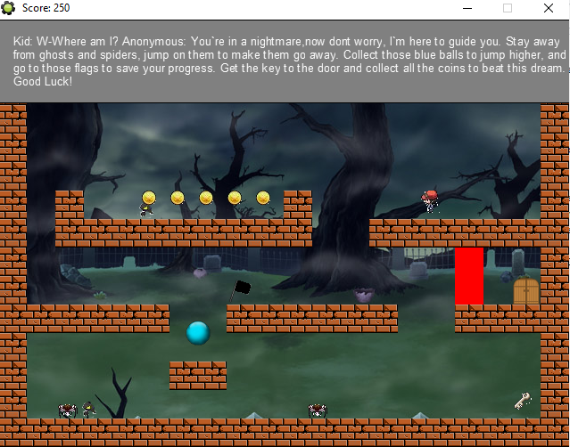
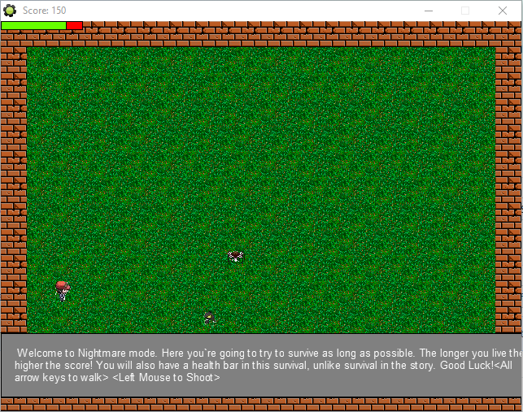

# gamemaker-competition-project
This game is called Amnesia: The Fatal Dream, a GameMaker competition game project. It is using the GameMaker Language and is a 2D platformer.

It has a Story mode and an endless Nightmare mode.

# How to execute the game?
The game can be played by executing the file located in "Amnesia The Fatal Dream/Game File/Amnesia The Fatal Dream.exe".

# Story Mode
The story mode is a 4-5 level gamemode where the story is driven through the dialogue boxes. Three of the levels are platformer based, whereas two of the levels are based on "survival" for a certain period of time. To progress through each platformer levels, the character must attain all coins and the level key. There are "checkpoints" which are represented by "black" flags which turn "white" once the checkpoint is activated. There are monsters which can be beaten by jumping on them, if the monster touches the character the level must be restarted. The character moves using the arrow keys.In the survival levels, the character must defend themselves from monsters that are chasing the last user position at "spawn" point of the monster. Using laser blasters, that can be shot by the user clicking the area where the shot should go, the user can eliminate monsters. If the character comes in contact with a monster the level is restarted. 

# Nightmare Mode
The Nightmare mode is essentially an extension of the "survival" mode from the story mode. Here, it is an endless mode where the character has a health bar and the score increases with the amount of time the user "survives" (or the health bar is greater than 0). Health decreases everytime the character comes in contant with one of the monsters. The monsters follow the user last known position at "spawn" of the monster, and "respawn" after coming in contact with the "wall" or the character. The user can use arrow keys to move and the mouse to shoot lasers at the monsters (which effectively kill the monsters).

# Works-Cited
Please check "Amnesia The Fatal Dream/Game File/Works Cited.docx".
